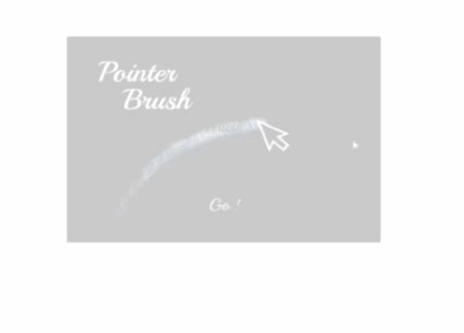

# Pointer Brush 🖌
### Interactive Art Project using [Processing](https://processing.org/) 
</img>
> `Pointer Brush` is interative art project, created using the processing and [wekinator](http://www.wekinator.org/), which supports interactive machine learning.
> The main theme of this project is that `you can draw a masterpiece only with a mouse pointer`, and all the animations and images that go into the work were drawn using Photoshop.    
     
You can see the [full version](https://youtu.be/pT9gJqPcqos) on the YouTube. 
 Please enjoy watching! (like 👠and subscribe 😻)   
   

## Details

</img>
 
</img>

</img>

</img>

</img>

</img>
